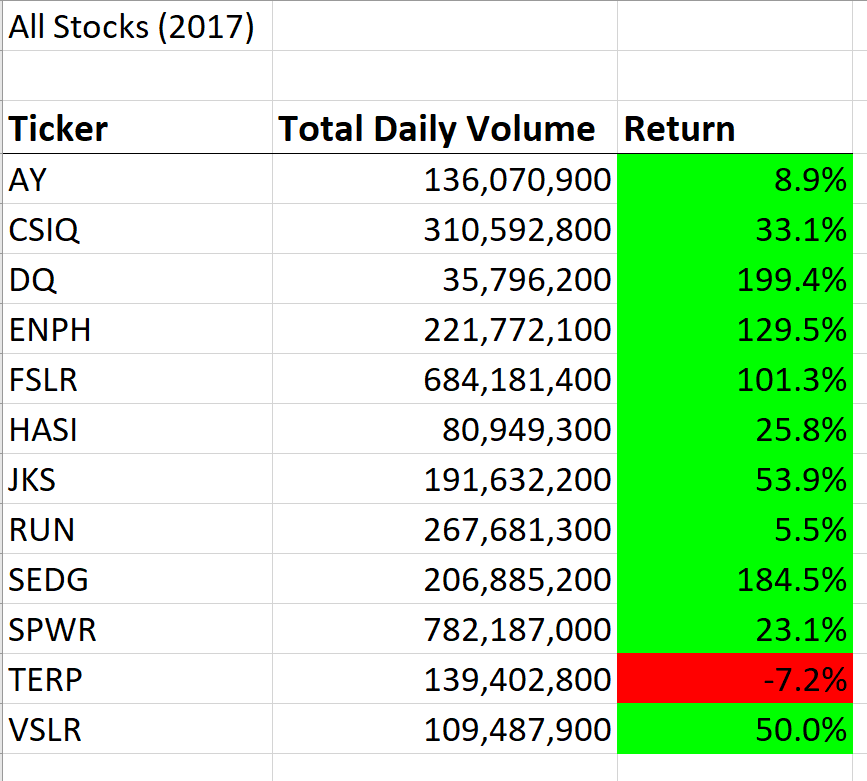
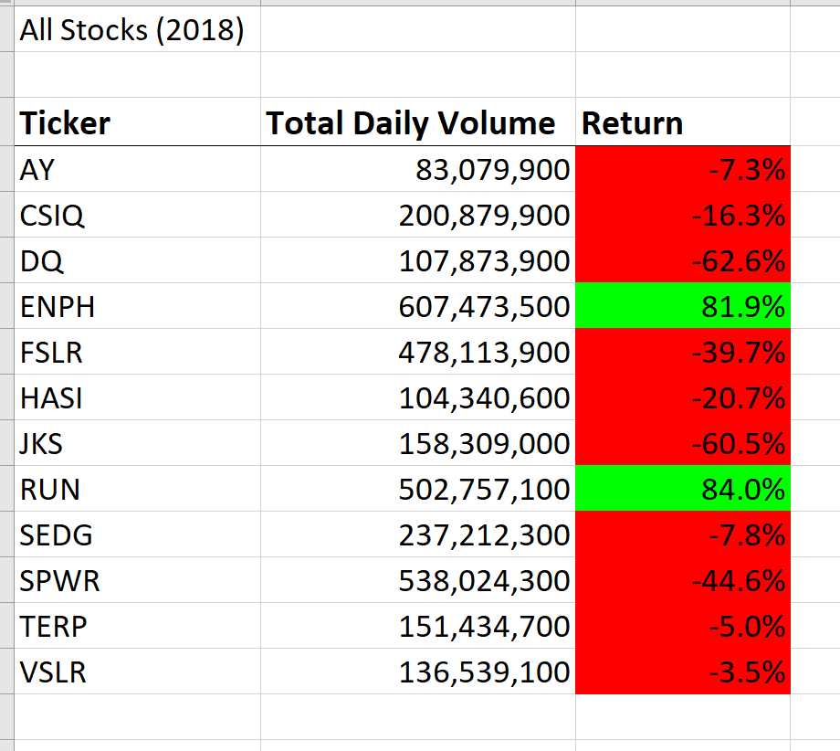
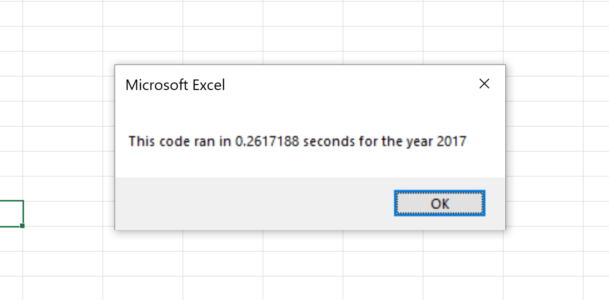
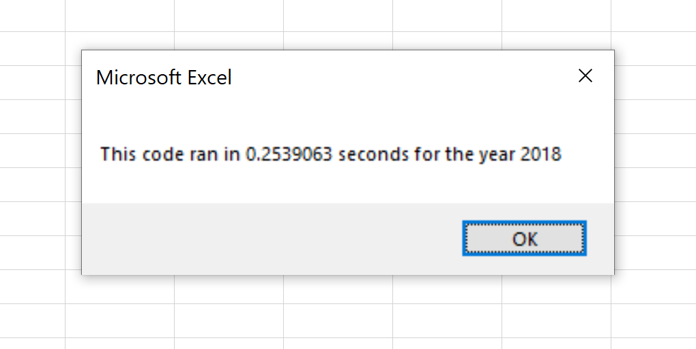

#Stock Analysis Refactor

##Project Overview
The focus of this project was to refactor code I had previously written that analyzes stock performance for yearly volume and return.

###Purpose

The purpose of the project was to improve the efficiency of the code in order to speed up run time, allowing for the code to function with much larger sets of data. 

###Background

Previously I prepared a VBA script for the client which analyzed the data of twelve stocks and output both yearly volume and annual return. The client would like to be able to use the script to analyze the entire stock market over the last few years. The original code has a run time of over 1 second, and would take far too long to run the entire stock market, so the clint has asked me to refactor the code in order to make it run faster.

##Results

Using the refactored VBA Script, analysis of twelve different stocks for 2017 and 2018 showed far better performance in 2017, with only one stock(TERP) having a negative return on the year. Additionally four different stocks(DQ,ENPH,FSLR,SEDG) had over 100% return in 2017. In contrast, in 2018, only two stocks(ENPH,RUN) had a positive yearly return. Based on this data, ENPH looks like the best investement, as it is the only stock to have a positive return in both years, and TERP is the worst, having two negative years in a row.

The refactored VBA Script performed far better than the original script whose run time was over 1 second for both 2017 and 2018. The Refactored script had a run time of 0.26 seconds for 2017, and 0.25 seconds for 2018. A reduction in run time of over 75% is a good result for the refactoring. 

In order to refactor I utilized the variable "tickerIndex" and output arrays tickerVolumes, tickerStartingPrices, and tickerEndingPrices to simplify the code.

'''

For i = 0 To 11
   
       tickerVolumes(i) = 0
       
   Next i
   
   'Loop over all the rows in the spreadsheet. Rows start at 2 and go until last row defined earlier by Rowcount
   
   For i = 2 To RowCount
   
       'Increase volume for current ticker. TickerIndex starts at 0 and goes up 1 after each run through, so on first run tickerVolumes(0) = tickerVolumes(0) + Cells(i,8).Value
       
       tickerVolumes(tickerIndex) = tickerVolumes(tickerIndex) + Cells(i, 8).Value
       
       'Check if the current row is the first row with the selected tickerIndex.
       
       If Cells(i - 1, 1).Value <> tickers(tickerIndex) Then
       
           tickerStartingPrices(tickerIndex) = Cells(i, 6).Value
           
       End If
       
       'Check if the current row is the last row with the selected ticker
       
       'If the next row’s ticker doesn’t match, increase the tickerIndex.
       
       If Cells(i + 1, 1).Value <> tickers(tickerIndex) Then
       
           tickerEndingPrices(tickerIndex) = Cells(i, 6).Value
           
           'Increase the tickerIndex.
           
           tickerIndex = tickerIndex + 1
           
       End If
       
   Next i     

'''  

##Summary

-Some big advantages of Refactoring code are making the code simpler and easier to understand, as well as improving run time of the code. Improving run time is especially important when working with large sets of data allowing the script to be run in a reasonable amount of time. Simplifying the code allows it to be more easily edited in the future reducing time and cost for making changes. A disadvantage of refactoring is that it works on already functioning code, so there is always the chance of breaking the existing code. This makes it important to keep proper backups of all existing code.

-How do these pros and cons apply to refactoring the original VBA script? In this project, the refactoring of the VBA script was extremely beneficial to reducing the run time of the analysis, cutting it down by over 75%. Additionally, the refactoring simplifies the code some, making it easier to understand for other developers. As I had many backups and saves of the original VBA script, the cons of refactoring I mentioned did not apply to this project.
